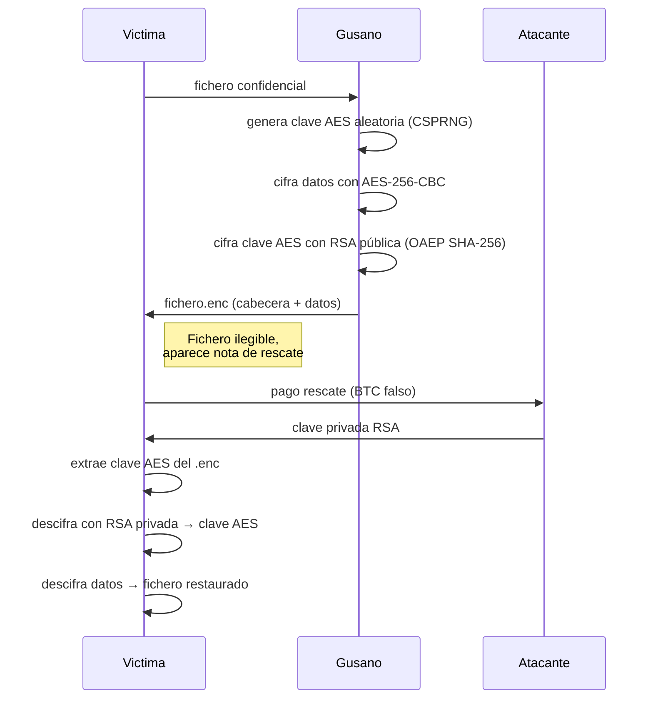

# 🧬 Lab: Esquema Criptográfico de un Ransomworm
*Demo educativa avanzada — Ciberseguridad*

---

## 🎯 ¿Qué demuestra este laboratorio?

Este proyecto implementa en C el **esquema criptográfico exacto** que utilizan ransomworms reales (WannaCry, REvil) con mejoras de robustez y realismo:

| Componente           | Implementación                                          |
|----------------------|---------------------------------------------------------|
| Cifrado de datos     | AES-256-CBC (OpenSSL)                                   |
| Protección de clave  | RSA-2048 OAEP con SHA-256                               |
| Generación aleatoria | `RAND_bytes` (CSPRNG de OpenSSL)                        |
| Formato de fichero   | Cabecera binaria con magic, versión y campos big-endian |
| Limpieza de memoria  | `OPENSSL_cleanse` en claves y buffers                   |

---

## 🧪 Objetivos pedagógicos

- Comprender el flujo criptográfico híbrido (AES + RSA).
- Analizar por qué el rescate es la única vía sin la clave privada.
- Observar medidas de seguridad reales (CSPRNG, OAEP, eliminación segura).
- Leer un formato de fichero malicioso con cabecera estructurada.

---

## 📦 Estructura del proyecto

```
lab-worm-crypto/
├── Dockerfile              ← Entorno aislado (gcc, openssl, depuración)
├── Makefile                ← Compilación con debug, tests y utilidades
├── README.md
├── demo/
│   └── run_demo.sh         ← Demo interactiva con colores y pausas
├── files_to_encrypt/       ← Ficheros víctima de prueba
└── src/
    ├── encrypt.c           ← Simula el módulo de cifrado del gusano
    └── decrypt.c           ← Descifrador tras "pagar el rescate"
```

---

## 🚀 Despliegue del laboratorio

### Instalación local (Linux/macOS) en mi caso Kali Linux(tambien se puede con docker aunque yo no lo he probado)

```bash
# Dependencias (Ubuntu/Debian)
sudo apt install gcc libssl-dev xxd

# Compilar
make keys           # genera claves RSA (public.pem / private.pem)
make clean && make all

# Lanzar demo completa
bash demo/run_demo.sh
# Si falla usa: sed -i 's/\r$//' demo/run_demo.sh   y después vuelve a lanzar
```

---

## 🔐 Flujo criptográfico (detallado)



---

## 📄 Formato del fichero `.enc`

| Offset  | Tamaño  | Campo                          | Descripción                              |
|---------|---------|--------------------------------|------------------------------------------|
| `0x00`  | 4 bytes | `magic` = `WORM` (`0x574F524D`) | Identificador único                     |
| `0x04`  | 2 bytes | `version` = 1 (big-endian)    | Versión del formato                      |
| `0x06`  | 2 bytes | `flags` (reservado)            | Uso futuro (compresión, metadatos)       |
| `0x08`  | 4 bytes | `enc_key_len` (big-endian)     | Longitud de la clave AES cifrada         |
| `0x0C`  | 256 B   | `encrypted_key`                | Clave AES cifrada con RSA-2048 OAEP      |
| `0x10C` | 16 B    | `iv`                           | Vector de inicialización (en claro)      |
| `0x11C` | N bytes | `ciphertext`                   | Datos originales cifrados con AES-256-CBC |

### Por qué es robusto

- **Magic number**: evita descifrar ficheros no generados por el gusano.
- **Endianness explícita**: campos multibyte portables entre arquitecturas.
- **OAEP con SHA-256**: protege contra ataques de texto cifrado elegido.

---

## 🧠 Demostración interactiva

La demo (`run_demo.sh`) incluye:

- **Simulación de propagación**: el "gusano" cifra múltiples ficheros en directorios víctima.
- **Pausas explicativas** con código de colores.
- **Visualización con `xxd`** del antes y después.
- **Generación de nota de rescate falsa** (ID de víctima único).
- **Limpieza automática** para repetir la demo.

---

## 📚 Conexión con casos reales

| Característica     | Este lab                 | WannaCry (2017)         | REvil/Sodinokibi     |
|--------------------|--------------------------|-------------------------|----------------------|
| Cifrado datos      | AES-256-CBC              | AES-128-CBC             | AES-256-CBC          |
| Protección clave   | RSA-2048 OAEP SHA-256    | RSA-2048 PKCS#1         | RSA-2048             |
| Propagación        | ❌ (no implementada)     | EternalBlue (MS17-010)  | RDP / phishing       |
| Nota rescate       | Simulada (ID único)      | `.wncry` / `.wncryt`    | Nota en HTML/TXT     |
| C2                 | No incluido              | TOR                     | TOR                  |

---

## ⚖️ Aviso legal y educativo

> Este software es **exclusivamente para entornos controlados de aprendizaje**.  
> No contiene ningún mecanismo de propagación, no se conecta a redes externas y no debe usarse fuera del contenedor de laboratorio.  
> El objetivo es entender la criptografía subyacente a este tipo de amenazas para poder **defenderse mejor**.
