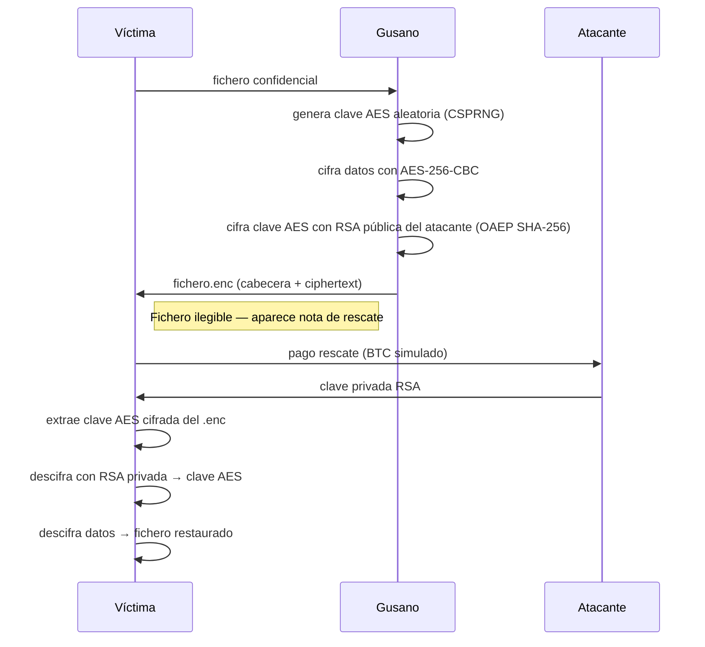

# Lab: Esquema Criptográfico de un Ransomworm

> Demo educativa avanzada — Ciberseguridad

---

## Qué demuestra este laboratorio

Este proyecto implementa en C el **esquema criptográfico exacto** que utilizan ransomworms reales (WannaCry, REvil), con un dashboard web para visualizar el proceso en tiempo real.

| Componente           | Implementación                                           |
|----------------------|----------------------------------------------------------|
| Cifrado de datos     | AES-256-CBC (OpenSSL)                                    |
| Protección de clave  | RSA-2048 OAEP con SHA-256                                |
| Generación aleatoria | `RAND_bytes` — CSPRNG de OpenSSL                         |
| Formato de fichero   | Cabecera binaria con magic, versión y campos big-endian  |
| Limpieza de memoria  | `OPENSSL_cleanse` en claves y buffers                    |
| Dashboard            | Flask + Socket.IO (Python 3)                             |

---

## Objetivos pedagógicos

- Comprender el flujo criptográfico híbrido (AES + RSA).
- Analizar por qué el rescate es la única vía de recuperación sin la clave privada.
- Observar medidas de seguridad reales: CSPRNG, OAEP, eliminación segura de claves.
- Leer un formato de fichero malicioso con cabecera estructurada.
- Visualizar la propagación en tiempo real mediante un panel web.

---

## Estructura del proyecto

```
lab-worm-crypto/
├── Dockerfile                    # Entorno aislado (gcc, openssl, gdb)
├── Makefile                      # Compilación, tests y tareas de laboratorio
├── readme.md
├── bin/
│   ├── encrypt                   # Binario compilado del cifrador
│   └── decrypt                   # Binario compilado del descifrador
├── dashboard/
│   ├── app.py                    # Servidor Flask + Socket.IO
│   ├── static/
│   │   └── socket.io.min.js
│   └── templates/
│       └── index.html            # Panel de control web
├── demo/
│   ├── run_demo.sh               # Demo interactiva en terminal (colores y pausas)
│   └── start_lab.sh              # Lab completo: dashboard + demo (recomendado)
├── files_to_encrypt/             # Ficheros víctima de prueba
├── files_to_encrypt.backup/      # Copia de seguridad para restaurar la demo
├── keys/
│   ├── public.pem                # Clave pública RSA-2048
│   └── private.pem               # Clave privada RSA-2048
└── src/
    ├── encrypt.c                 # Módulo de cifrado (simula el gusano)
    └── decrypt.c                 # Módulo de descifrado (simula el pago del rescate)
```

---

## Requisitos previos

**Sin Docker:**
- `gcc` y `make`
- `libssl-dev` (OpenSSL)
- `python3` con `flask` y `flask-socketio`

**Con Docker** (recomendado para aislamiento):
- Docker Engine

---

## Despliegue del laboratorio

### Opción A — Lab completo (dashboard web + demo en terminal)

```bash
make lab
```

Abre el navegador en `http://localhost:5000` para ver el panel de control, luego observa la demo en la terminal.

### Opción B — Solo la demo en terminal

```bash
make demo
```

### Opción C — Solo el dashboard Flask

```bash
make dashboard
```

### Opción D — Docker (entorno completamente aislado)

```bash
docker build -t lab-ransomworm .
docker run --rm -it lab-ransomworm
# Dentro del contenedor:
make lab
```

### Otras tareas del Makefile

| Comando       | Descripción                                        |
|---------------|----------------------------------------------------|
| `make all`    | Compila `encrypt` y `decrypt`                      |
| `make keys`   | Genera un par de claves RSA-2048 en `keys/`        |
| `make test`   | Test rápido de cifrado + descifrado con diff       |
| `make debug`  | Compila con `-g -O0 -fsanitize=address`            |
| `make clean`  | Elimina binarios y directorios temporales          |

---

## Flujo criptográfico



---

## Formato del fichero `.enc`

| Offset  | Tamaño  | Campo            | Descripción                                    |
|---------|---------|------------------|------------------------------------------------|
| `0x000` | 4 B     | `magic`          | `WORM` (`0x574F524D`) — identificador único    |
| `0x004` | 2 B     | `version`        | `1` (big-endian)                               |
| `0x006` | 2 B     | `flags`          | Reservado (compresión, metadatos futuros)       |
| `0x008` | 4 B     | `enc_key_len`    | Longitud de la clave AES cifrada (big-endian)  |
| `0x00C` | 256 B   | `encrypted_key`  | Clave AES cifrada con RSA-2048 OAEP            |
| `0x10C` | 16 B    | `iv`             | Vector de inicialización (en claro)            |
| `0x11C` | N B     | `ciphertext`     | Datos originales cifrados con AES-256-CBC      |

**Por qué el formato es robusto:**
- El magic number evita descifrar ficheros no generados por el gusano.
- Campos multibyte con endianness explícita garantizan portabilidad.
- OAEP con SHA-256 protege contra ataques de texto cifrado elegido (CCA2).

---

## Demostración interactiva

La demo (`run_demo.sh`) incluye:

- Simulación de propagación: el "gusano" cifra múltiples ficheros en directorios víctima.
- Pausas explicativas con código de colores.
- Visualización con `xxd` del antes y después.
- Generación de nota de rescate simulada con ID de víctima único.
- Limpieza automática para repetir la demo.

El dashboard (`app.py`) emite eventos Socket.IO en tiempo real con el estado de cada fichero cifrado/descifrado.

---

## Comparativa con casos reales

| Característica     | Este lab                   | WannaCry (2017)       | REvil/Sodinokibi     |
|--------------------|----------------------------|-----------------------|----------------------|
| Cifrado datos      | AES-256-CBC                | AES-128-CBC           | AES-256-CBC          |
| Protección clave   | RSA-2048 OAEP SHA-256      | RSA-2048 PKCS#1       | RSA-2048             |
| Propagación        | No implementada            | EternalBlue (MS17-010)| RDP / phishing       |
| Nota de rescate    | Simulada (ID único)        | `.wncry` / `.wncryt`  | HTML / TXT           |
| C2                 | No incluido                | TOR                   | TOR                  |

---

## Aviso legal

> Este software es **exclusivamente para entornos controlados de aprendizaje**.
> No contiene mecanismos de propagación real, no se conecta a redes externas y no debe ejecutarse fuera del contenedor de laboratorio.
> El objetivo es comprender la criptografía subyacente a este tipo de amenazas para poder defenderse mejor.
